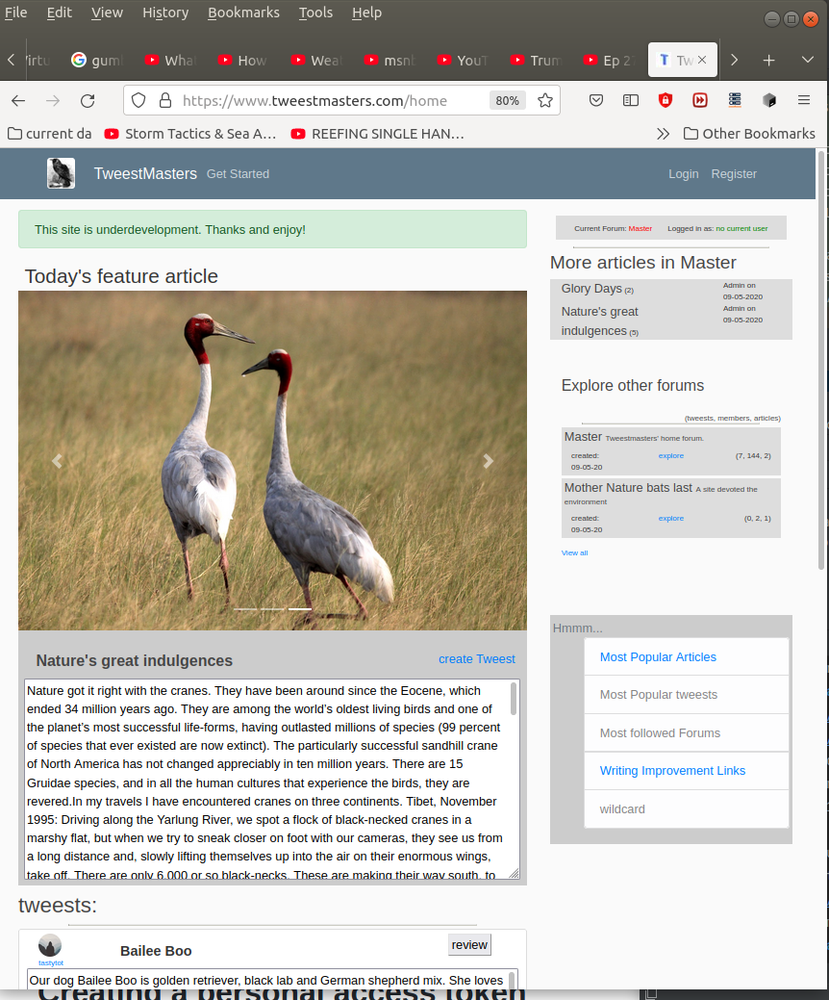
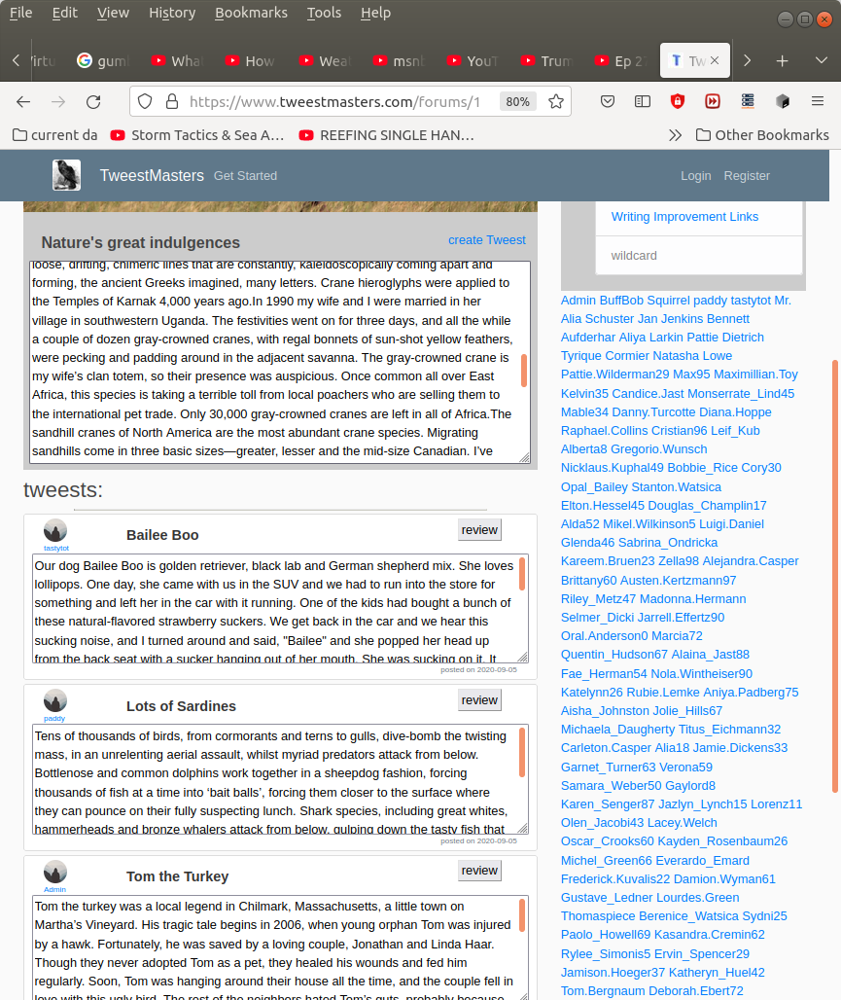

### This is a currently running site that can be viewed at

<h1><a href="https://www.tweestmasters.com/">Tweestmasters.com</a></h1>

<h4>Tweestmasters is a cross between twitter and toastmasters. It is meant to improve your writing skills by writing and reviewing short stories or tweests. Give it a try. I know it is rough maybe you could make it better?</h4>

<h2> The Home Page</h2>

<h3> My users and the master forum</h3>

<h4>current missing fuctionality</h4>
<ul>
  <li>all forums are public at the moment</li>
  <li>content length final decision and verification</li>
  <li>something funky on the account page</li>
  <li><h5>this is a work in progress with no testing</h5></li>
</ul>
